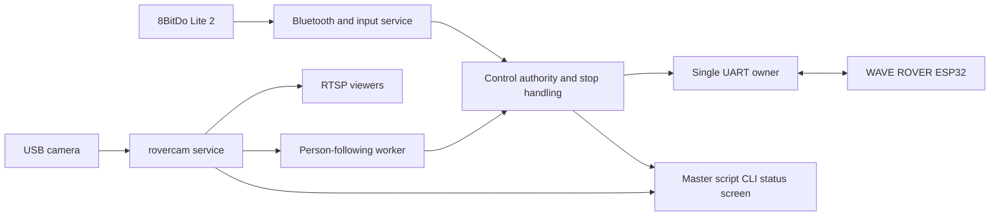

# apptirover

Updated: 2026-09-25. Status: requirements and proposed design; no implementation.

## 1. Intended outcome

Build an application on this Raspberry Pi 5 that controls the connected plain
Waveshare WAVE ROVER, accepts a directly connected Bluetooth gamepad, streams
camera video with person detection, and later follows a detected person.

The user's requirements are:

1. Control the whole rover through this Raspberry Pi.
2. Drive using an 8BitDo Lite 2 Bluetooth controller. The controller must have
   master override over every other source of motion, including autonomy.
3. When no controller is paired, putting the Lite 2 into pairing mode must be
   enough to pair it automatically. Subsequently, powering it on must reconnect
   it automatically, without any action on the rover.
4. Make the local camera stream and human detection available, using the work
   already present in `/home/mieszko/rovercam`.
5. Add autonomy, initially following a detected human, while retaining controller
   override at all times.
6. Consult the WAVE ROVER documentation and `/home/mieszko/ugv_rpi` to avoid
   repeating existing work, but build an application tailored to this rover
   rather than copying the vendor application wholesale.
7. Develop in Python using a project virtual environment (`venv`).
8. Launch through a master script that immediately displays a live CLI status
   screen, including rover telemetry, 8BitDo connectivity, and camera presence.
   Expand this screen as new features are added.

The architecture, button assignments, limits, and milestones below are proposed
defaults. They are distinguished from the requirements above and from observed
facts; they have not been implemented or validated on the moving rover.

Only documentation is authorized now. Do not write application code, install
dependencies, alter system configuration, pair devices, open the camera, flash
firmware, or send rover commands during this planning task.
Repository initialization, committing this document, configuring the requested
GitHub remote, and pushing the documentation are separately authorized.

## 2. Hardware and environment

| Item | Evidence and current understanding |
| --- | --- |
| Project | `/home/mieszko/apptirover`; this document is `apptirover.md` |
| Host | User specifies Raspberry Pi 5; device tree reports Model B Rev 1.1 |
| OS | Local `/etc/os-release` reports Debian GNU/Linux 13.7, Trixie |
| Kernel | Local inspection reports `6.18.50+rpt-rpi-2712` |
| Chassis | User specifies plain Waveshare WAVE ROVER |
| Wiring | User reports GPIO TX, RX, GND, SCL, SDA connected to rover |
| Network | User confirms Wi-Fi and internet access |
| Controller | User specifies 8BitDo Lite 2; pairing and input mapping not tested |
| Camera | Existing rovercam records identify Arducam B0627 USB3 / IMX900, last tested 2026-09-23 |
| Other hardware | No pan-tilt, arm, lidar, depth sensor, or additional lights confirmed |

TX/RX/GND provide the UART connection. SCL/SDA belong to a separate I²C bus.
Document the physical header pins, BCM numbers, and rover-side labels before
implementation. Read the onboard sensors through the ESP32's serial interface
where supported; direct Pi I²C access is not assumed to be necessary.

The boot configuration currently contains `dtparam=uart0=on`. The restricted
inspection environment did not expose serial, camera-by-id, or input-by-id
device paths. This does not establish that the real host lacks those devices;
the actual UART mapping, port ownership, camera identity, and Bluetooth status
remain to be checked with host device access.

The clone selects `/dev/ttyAMA0` for Pi 5. Do not blindly substitute
`/dev/serial0`: on Pi 5 that alias normally identifies the debug UART. Confirm
which device actually serves the wired GPIO pins and that no serial console
uses it. Preserve Bluetooth while configuring UART. See
[Raspberry Pi UART documentation](https://www.raspberrypi.com/documentation/computers/configuration.html#configuring-uarts).

The Pi's power source and the rover battery arrangement remain unrecorded.
Do not assume that software can switch the rover's main power or power the Pi
back on after shutdown.

## 3. Findings from the existing software

### rovercam: retain the camera and detection foundation

Reviewed [README](../rovercam/README.md),
[capture-stall investigation](../rovercam/docs/capture-stall.md),
[camera server](../rovercam/rovercam/app.py),
[detector](../rovercam/rovercam/detection.py), and
[CLI settings](../rovercam/rovercam/__main__.py).

Existing functionality:

- USB V4L2 capture and native GStreamer scaling, overlays, and H.264 encoding.
- Built-in RTSP server at `rtsp://<PI-IP>:8554/camera`; multiple viewers share
  an encoder. Capture and inference continue without viewers.
- YOLO26n exported to NCNN, retaining the person class only. Default model input
  is 320×320, using two inference threads in a separate process.
- A shared latest-frame slot and bounded video queues prevent growing backlogs.
- Current configured defaults are 640×480 output at 30 FPS, detection capped at
  15 FPS. The recorded B0627 capture format is 2064×1552 YUYV; requesting 640×480
  directly from that unit is not the recorded working configuration.
- Person boxes are normalized coordinates with confidence and class, internally
  accompanied by the source frame timestamp and inference duration.
- Stale boxes expire after 0.5 seconds of source-frame age. Raw frames older than
  0.2 seconds are discarded before encoding.
- Bounded capture recovery retains the RTSP server; repeated stalls eventually
  exit with an error. No boot service is installed according to the README.

The recorded short tests achieved approximately 30 FPS video and 15 detections
per second, with roughly 21–25 ms inference. These are historical local results,
not new measurements or guarantees of camera reliability or remote display delay.

**Known issue:** capture stalls during camera movement or scene changes. This
also occurred in raw V4L2 testing after physically reconnecting the camera,
including at 15 FPS. Lowering FPS or restarting capture is not an established
fix. The report's next isolation step is the same test on another computer.

There is currently no external detection subscription API and no persistent
person tracking. The overlay consumes the internal result queue. Integration
needs an explicit result publisher and health interface; autonomy must not
decode the annotated RTSP stream or open a second camera/inference pipeline.

### ugv_rpi: use selectively as a reference

Reviewed local commit `3ae9f20`, particularly
[base_ctrl.py](../ugv_rpi/base_ctrl.py), [app.py](../ugv_rpi/app.py),
[config.yaml](../ugv_rpi/config.yaml),
[browser controller](../ugv_rpi/templates/control.js),
[setup.sh](../ugv_rpi/setup.sh), and the English protocol tutorials.

| Useful reference | How apptirover should use it |
| --- | --- |
| JSON command framing and telemetry | Implement a small adapter for the verified WAVE ROVER firmware |
| OLED and optional peripheral commands | Expose supported capabilities through the same rover service |
| Camera and UI examples | Learn interaction patterns; keep the existing rovercam pipeline |
| Browser gamepad handling | Reference only; apptirover reads the controller on the Pi directly |
| Installation and startup scripts | Review individual settings; create a separate installation plan |

Specific differences that matter:

- The clone's default configuration identifies `UGV Rover`, with motion limits
  intended for its broader set of chassis. Those defaults are not this rover's
  capability specification.
- Its browser gamepad path uses the browser's Gamepad API and sends `T=13`
  linear/angular velocity commands. This does not provide Pi-side pairing or
  the intended plain WAVE ROVER drive mapping.
- `BaseController` uses an unbounded FIFO for outgoing commands. Motion in
  apptirover must replace old pending requests, so a stop cannot wait behind
  a backlog of stale motion.
- Initializing the vendor application opens the serial port and sends startup
  commands. Treat the files as references, not harmless modules to import for
  discovery.
- **The cloned installer adds `dtoverlay=disable-bt` and disables Bluetooth
  services. Running it would conflict directly with this project's controller
  requirement.** Its hotspot setup also does not match the existing Wi-Fi setup.
- The clone contains a [GPL license](../ugv_rpi/LICENSE); retain source and license
  provenance for any code selected for reuse. No vendor code has been copied.

## 4. Rover interface and capability scope

The [WAVE ROVER wiki](https://www.waveshare.com/wiki/WAVE_ROVER) documents UART
at 115200 baud with newline-delimited JSON. Its recommended drive command is
`T=1`, with left/right values from −0.5 to +0.5. On this chassis these represent
motor power: 0.5 means full PWM, not 0.5 m/s. The motors lack encoders. `T=11`
provides direct PWM values from −255 to +255 for debugging; `T=13` velocity
control and encoder PID settings are not the basis for this plain rover.
The wiki describes stopping after three seconds without a new movement command.
Verify that behavior on the installed firmware before relying on it.

Use a single Pi service as the owner of the serial port. It should support:

| Capability | Planned behavior |
| --- | --- |
| Drive | Forward/reverse, differential steering, and turning on the spot, with bounded left/right power |
| Stop | Explicit zero drive output, available from controller and service fault handling |
| Telemetry | Parse supported chassis, battery, and IMU feedback; mark missing/stale values explicitly |
| OLED | Show connection, mode, stop reason, and useful status without delaying drive commands |
| Optional outputs | Expose only attached, verified peripherals; default unused outputs off |
| Configuration | Keep firmware-specific settings separate from ordinary driving |

The local protocol tutorials and
[Waveshare command reference](https://www.waveshare.com/wiki/08_Sub-controller_JSON_Command_Set)
describe `T=130` feedback requests, `T=131` continuous feedback, `T=142` feedback
interval, `T=143` echo, and `T=126` IMU requests. The clone demonstrates `T=3`
OLED updates and `T=132` auxiliary outputs. Verify supported commands, units, and
reply fields against this board; a multi-model sample is not proof of support.

Do not treat a successful write or echoed command as proof that the wheels
moved or stopped. Without encoders, commanded power is not measured speed or
distance. Expose these distinctions in status and logs.

During implementation, identify any other firmware control paths, including the
ESP32's own Wi-Fi/HTTP and ESP-NOW control. The Pi's priority rules cannot govern
commands that bypass it. Establish sole motion authority, disabling or excluding
those alternative paths through verified firmware settings where possible.
Record any remaining limitation before claiming override works over all sources.

## 5. Proposed architecture

Python and a project-local `.venv` are confirmed requirements. Keep the native
GStreamer/NCNN media pipeline. Use the system-compatible Python interpreter;
rovercam currently relies on OS-provided GObject/GStreamer bindings, so its
environment needs access to those bindings. Keep model-export tooling separate
from the runtime environment. Record dependencies reproducibly and exclude
virtual environments, caches, credentials, and downloaded models from Git when
implementation begins. No environment or dependency installation is needed for
this documentation commit.

Proposed dependencies
include BlueZ D-Bus for Bluetooth, Linux input events through
[python-evdev](https://python-evdev.readthedocs.io/en/latest/tutorial.html), and
[pySerial](https://pyserial.readthedocs.io/en/latest/pyserial_api.html) with bounded
read/write timeouts and exclusive port access where supported. Choose exact
versions during implementation on the current OS.

The control authority and serial owner form one small core service. Bluetooth
pairing/input, camera processing, and autonomy run in separate processes so a
stalled inference call or pairing operation cannot hold the control loop.
Messages between processes carry sequence numbers, source identity, a monotonic
timestamp, expiry, and the current control-session identifier where relevant.
Use bounded local IPC, such as Unix sockets, with explicit reconnection behavior.

Only the core may send motion to the rover. Camera and autonomy processes never
open UART. Future web controls must request authority through the same core.
Raw JSON passthrough must not become a route around motion arbitration.

On takeover, stop, disconnect, or restart, invalidate the old control session
and discard its pending motion. The serial writer rechecks authority and expiry
immediately before transmitting. Diagnostics and OLED messages have a bounded
budget and lower priority than motion and stop requests.

## 6. Automatic Bluetooth pairing and reconnection

Pair the controller directly to the Raspberry Pi, independently of any browser,
phone, internet connection, or camera service.

Start with the controller in **D mode** and validate its Linux input mapping.
The [8BitDo manual](https://manual.8bitdo.com/lite2/lite2-android-bluetooth.html)
describes powering on with Home and holding Pair for three seconds for initial
pairing. The [manufacturer product page](https://www.8bitdo.com/lite2/) lists
Raspberry Pi compatibility. The exact firmware/mode behavior on this Pi still
requires a physical test; do not assume an Xbox or Switch button numbering.

Proposed pairing behavior:

1. At service startup, load the saved designated controller and reconcile it
   with BlueZ's bonds. Recover a single matching existing bond where possible.
2. If no designated controller is bonded, continuously offer automatic
   enrollment through repeated discovery windows with retry backoff. Putting
   the Lite 2 into pairing mode should be the only normal user action.
3. Match the expected controller name plus device/service information. Pair one
   matching candidate through a headless pairing agent, trust the successful
   bond, connect its input profile, and persist its identity.
4. Mark the controller ready only when its Linux input device is available and
   its expected axes/buttons have been validated. Bluetooth `Connected` alone
   is insufficient.
5. After enrollment, stop accepting replacement controllers automatically. An
   already paired controller being switched off is a reconnect state, not an
   invitation to pair a different device.
6. On later power-on, accept the bonded controller's reconnect and attempt
   reconnection with backoff when needed. Preserve the bond across restarts,
   Pi reboots, and temporary signal loss; do not repeatedly unpair/re-pair it.
7. If bonding was lost, allow re-enrollment of the saved controller when it is
   put back in pairing mode. Deliberate replacement uses a future “forget
   controller” action; routine startup never needs it.

BlueZ provides discovery, pairing, trust, connection, property notifications,
and pairing-agent APIs. Use those interfaces instead of scripting an interactive
terminal session. See its [Adapter](https://bluez.readthedocs.io/en/latest/adapter-api/),
[Device](https://bluez.readthedocs.io/en/latest/device-api/), and
[Agent](https://bluez.readthedocs.io/en/latest/agent-api/) documentation.

The unattended agent accepts only the intended enrollment candidate or saved
identity and appropriate input services. It must not approve arbitrary nearby
devices. If multiple indistinguishable Lite 2 candidates are present, keep the
rover stopped and show the ambiguity rather than select one arbitrarily. For
normal first pairing, have only the intended Lite 2 in pairing mode nearby.

Expose separate states: searching, pairing, bonded/disconnected, connecting,
input-ready, and error. Retry transient failures automatically and recover after
Bluetooth service restarts. Keep the motors disarmed through pairing/reconnect;
successful reconnection must never replay the last stick position.

## 7. Master override and manual driving

The controller has priority over every other motion producer. A stop or active
hardware fault still means zero output; “override” does not bypass stop handling.

Priority from highest to lowest:

1. Latched stop, invalid command, or a fault that requires stopping.
2. Controller takeover/manual drive.
3. Explicitly enabled autonomy.
4. Idle: zero output.

Proposed operating states:

| State | Output and permitted transitions |
| --- | --- |
| Disarmed | Zero; boot, core restart, or controller reconnect starts here |
| Manual ready | Zero until the drive-enable control is held |
| Manual driving | Controller determines drive; releasing drive-enable stops |
| Following | Only the current autonomy session may request movement |
| Stopped/fault | Zero; an explicit re-arm is required after the cause clears |

Proposed physical button layout, subject to checking the actual input events:

| Input | Action |
| --- | --- |
| Left stick | Forward/reverse and left/right steering |
| R shoulder, held | Manual drive enable; pressing it also takes over from autonomy |
| B | Immediate latched stop in any mode |
| Plus/Start | Re-arm to manual ready, with neutral sticks, R released, and faults cleared |
| X | Explicitly enter following from manual ready when all prerequisites pass |
| D-pad up/down | Select a bounded drive-power limit |

Any deliberate drive-stick movement beyond the takeover deadzone cancels
following immediately, even without R held. With R released it stops; with R
held the controller supplies the new drive request. Releasing R returns to zero
and manual ready. Returning the sticks to center never restarts autonomy.
Following must be enabled again explicitly. A camera or autonomy restart also
must not re-enable it.

Use calibrated axes, a deadzone with hysteresis, and bounded differential mixing.
Normalize combined throttle/turn input before scaling to the rover's allowed
left/right power. Start with a conservative power cap and measure low-speed
motor response; do not add an unexpected minimum-power jump. Smooth ordinary
changes but let stop requests bypass acceleration smoothing. These are power
limits until actual physical speeds have been measured.

Proposed timing targets, all requiring later measurement:

| Item | Initial target |
| --- | --- |
| Core arbitration | 50 Hz, independent of camera and inference |
| Normal serial motion refresh | 20 Hz; immediate handling of stop/takeover |
| Input-service and autonomy request expiry | At most 250 ms without a valid producer update |
| Person source-frame age while following | At most 250 ms; independent of overlay expiry |
| Received controller event to UART command | At most 100 ms under full camera load |

Expire commands at the core, not only at their producer. A worker that is hung
must not leave the last nonzero request active. Stop on controller disconnect,
input-device removal, reader failure, or stale input-service health. Require a
connected, healthy controller throughout the first version of autonomous driving.
Stop autonomy if that prerequisite disappears.

Distinguish input-service health from radio health. Linux input events may be
silent while a stick is held steady; “no changed input for 250 ms” is not by
itself proof of disconnect. Conversely, repeatedly publishing a cached stick
state does not prove the controller is still reachable. Validate the Lite 2's
report behavior and BlueZ disconnect detection, and measure powered-off and
out-of-range stop latency. Do not claim the 250 ms producer timeout guarantees
the same bound for a silent radio failure.

If the whole Pi/control process fails, controller input cannot be handled by
software on it. The verified ESP32 movement timeout is the fallback. A shorter
failure bound may require a supported firmware watchdog setting or later firmware
work; none is assumed available. This software stop is not an independent
physical emergency-stop circuit.

## 8. Camera streaming and detection integration

Keep rovercam as the sole camera owner and share one inference pipeline between
overlays and autonomy. Extend it with a small local metadata and health publisher
during implementation. One dispatcher consumes detection results and distributes
them to both uses, avoiding competing reads from `DetectionWorker.latest()`.
Slow subscribers must not delay capture, inference, or streaming.

Proposed metadata contract:

| Field | Meaning |
| --- | --- |
| Stream generation and frame sequence | Identify restarts and reject duplicates/old results |
| Source-frame monotonic timestamp | Age of the image used for inference |
| Inference completion timestamp | Separate processing delay from frame age |
| Frame dimensions and transform | Define coordinates, borders, orientation, and crop |
| Person detections | Normalized boxes, confidence, class; empty list is a valid observation |
| Capture and inference health | Independent last-frame/result ages and error states |
| Recovery state | Restart count and whether frames are currently reliable |

The existing detector timestamp is a GStreamer buffer PTS, not automatically a
system monotonic timestamp. Map pipeline time to the Pi's monotonic clock and
handle pipeline resets explicitly. Do not stamp an old frame as fresh at IPC
receipt or inference completion. Invalidate all pending results and the follow
target on a camera generation change.

RTSP remains the first streaming interface, compatible with VLC/ffplay. A browser
viewer would require an additional supported delivery path, such as WebRTC;
an RTSP URL is not by itself browser playback. Add that only if a browser viewer
is chosen. No internet service is needed for local capture, inference, or driving.

Stream access is initially on the local network. The existing RTSP service binds
to all interfaces and permits unauthenticated viewing; record the intended
listener/access policy before exposing it more broadly. Remote internet viewing
is not a requirement currently.

On camera failure, status must show stale/unavailable video even if a player's
last image remains visible. Person-following stops using its own freshness timer;
it must not wait for rovercam's roughly two-second stall recovery threshold.
Direct manual driving can remain available independently of the camera, provided
the controller and rover connection are healthy.

Camera reliability is an explicit acceptance condition for following. Resolve
or sufficiently isolate the recorded stall and demonstrate stable operation
with movement/scene changes before treating mobile following as complete.

## 9. First autonomy behavior: follow a person

Implement a small worker that consumes detection metadata and submits expiring
drive intentions. It receives no direct motor access. Start disabled, and enable
only by an explicit controller action with fresh vision, a healthy rover link,
a connected controller, and no active stop.

Proposed initial behavior:

1. On enable, acquire a clearly distinguishable person near the image center
   over several fresh observations. If selection is ambiguous, remain stopped.
2. Maintain a local target track using position/box overlap and continuity.
   Person detection alone is not identity recognition; crossing people can
   remain ambiguous. Stop rather than silently follow a different person.
3. Steer from the target's horizontal offset. Reduce forward power while turning
   substantially and stop forward motion when alignment is inadequate.
4. Use apparent person-box size as an initial closeness signal with a tunable
   target band. Reduce forward power as the target fills that band; stop when
   close enough. Do not present this as distance in metres.
5. Begin with forward following only; do not reverse automatically when the
   target approaches the camera. Manual reverse remains available.
6. Stop and cancel following on missing, old, uncertain, or ambiguous target
   data, a camera restart, lost controller, lost rover connection, or override.
   Require explicit re-enable; do not keep driving during a search or silently
   reacquire another person.

No depth sensor, obstacle sensor, or wheel encoders have been confirmed. The first
behavior is therefore supervised visual following in a clear test area, without
claims of obstacle avoidance, stair detection, navigation, precise following
distance, or recognizing a particular individual. Reliable distance keeping and
obstacle avoidance would require further sensing and validation.

## 10. Startup, status, and recovery

The main user entry point is a Python master script, launched inside the project
virtual environment. It starts or attaches to the managed components and shows
the CLI status screen immediately, including while devices are still being
discovered. Running it a second time must not start competing UART owners or
camera captures. Exact script/module naming will be chosen during implementation.

Initially the master script can supervise separate control, Bluetooth/input,
vision, and autonomy processes. Later systemd can manage their boot lifecycle;
the master script then attaches to the same services for its interactive status
view. Avoid two competing process supervisors. Start pairing and controller
handling at boot without a desktop login once boot deployment is implemented.
Internet or Wi-Fi availability must not gate local gamepad control. Use bounded
restart policies so camera failures do not create an unlimited restart loop or
restart the control core.

Every control-core start initializes to disarmed, clears old sessions, establishes
the verified rover link, and requests zero output before enabling motion. On
serial reconnection repeat that sequence. Never replay motion saved before a
crash. On orderly shutdown, request zero output before closing UART; abrupt
failure still depends on the board's timeout.

Configuration should cover the hardware profile, UART device/baud, controller
identity/mode/mapping, deadzones, power limits, producer deadlines, camera device
and formats, model settings, metadata limits, and following thresholds. Keep
controller bond state separate from ordinary editable configuration. Do not
persist an armed or following state.

The CLI status screen is part of the first version, not deferred to a future web
interface. Show an at-a-glance overview with expandable subsystem sections:

| Section | Initial fields and future additions |
| --- | --- |
| Application | Startup progress, uptime, armed state, active authority, stop/fault reason |
| Rover | UART connection, last feedback age, battery voltage and available IMU data |
| 8BitDo | Searching/pairing/bonded/connected/input-ready state, device name, manual override availability |
| Camera | Detected or missing, opened or unavailable, capturing or stalled, selected format |
| Stream | Available or unavailable, RTSP address, output FPS |
| Detection | Enabled/disabled/loading/error, person count, detection FPS and source-frame age |
| Autonomy | Disabled/ready/following/stopped, selected target, reason following is unavailable |
| Events | Recent connections, recoveries, mode changes, and errors |

Keep device presence separate from usability: a plugged-in camera can be stalled,
and a Bluetooth connection may not yet have a usable input device. Missing or
unimplemented telemetry shows “unknown”, “unavailable”, or “not implemented”,
never a fabricated zero or healthy state. Display units and freshness for sensor
values, and do not invent a battery percentage from uncalibrated voltage.

Refresh the terminal view at a modest rate, initially around 2 Hz, without
blocking the control loop. Keep logs from corrupting the display; use a recent
event area and a separate log destination. When output is redirected or a terminal
cannot redraw, use periodic plain-text snapshots. New features add status fields
through a common snapshot interface rather than building their own displays.

Ctrl+C should exit through an explicit lifecycle path: when the master owns the
processes, request stop and shut them down cleanly; when attached to persistent
services, request disarm before detaching. Closing a terminal must never leave an
old manual motion request valid. Document the chosen behavior in the eventual CLI.

Mirror a concise subset on the OLED where supported. A web interface is optional
and would use the same status data and motion priority rules. Log mode changes
and faults with timestamps; avoid logging every frame or flooding UART with
display updates.

## 11. Development stages and acceptance criteria

These are future implementation and validation steps, not actions performed now.

| Stage | Work | Completion evidence |
| --- | --- | --- |
| 1. Establish hardware profile | Confirm wiring, UART mapping, firmware, telemetry, power, controller mode, and camera identity; inspect other UART users and firmware command paths | Recorded working profile; no unsupported chassis assumptions; Bluetooth retained |
| 2. Core, master script, and stop rules | Establish Python/venv, master launch, initial CLI status, one serial owner, authority state machine, bounded motion, and stop handling | Status appears with missing/disconnected devices; simulated tests reject stale commands; controlled motor tests verify direction, zero output, and firmware timeout |
| 3. Controller lifecycle | Automatic enrollment, persistent bonding, reconnection, calibrated inputs, manual driving | First pairing needs only controller pairing mode; power cycling either side reconnects; reconnect remains disarmed |
| 4. Camera integration | Preserve existing pipeline, add metadata/health, investigate the recorded capture stall | RTSP and person boxes work; source timestamps remain valid across recovery; slow viewers cannot block control |
| 5. Following | Target selection/continuity, bounded steering and approach, controller cancellation | Target loss stops; close target stops approach; ambiguous people do not cause silent target switching |
| 6. Boot and combined operation | Service lifecycle, status, long-running load and failure checks | No login needed; repeated startup/recovery never resumes movement; camera load does not defeat override |

Essential behavioral checks during those stages:

- Use a simulated serial sink first, then restrained/wheels-clear tests before
  ground driving. Verify the plain rover's command scale and motor deadband.
- Pair with no prior bond; reconnect after controller power-off, Pi reboot,
  Bluetooth restart, and loss of range. Check incorrect and ambiguous devices.
- Hold a stick steadily to distinguish input silence from a lost controller.
  Measure real radio-loss-to-stop latency, not only an injected disconnect event.
- Override during following while the camera, inference, or autonomy is slow or
  hung. Check that delayed autonomy messages cannot regain authority.
- Flood normal requests and verify stop bypasses pending motion and smoothing.
  Releasing R stops; centering the sticks does not resume following.
- Disconnect the camera, send empty detections, delay metadata, restart the
  pipeline, and present multiple crossing people. Check source age and target loss.
- Interrupt UART, restart the core, and terminate it abruptly. Verify the actual
  firmware timeout separately from the normal host stop path.
- Test 30 FPS video/15 FPS detection under combined control load; record control
  latency, CPU/temperature, capture stalls, and physical stopping distance.
  Historical rovercam measurements are a baseline, not a passing integration test.
- Repeat scene-change and camera-movement tests long enough to expose the known
  stall; a short successful stream alone does not close that issue.
- Launch the master script with no controller or camera, then connect them and
  verify status transitions without restarting the screen. Check missing/stale
  telemetry, redirected output, component failure, duplicate launch, and clean
  exit while preserving the control-loop latency target.

## 12. Decisions and measurements still open

The requirements are sufficient to plan the architecture. The remaining items
can be resolved during review and implementation:

- Final controller button preferences; the proposed R/B/Start/X mapping is not
  yet a user-selected mapping.
- Exact physical wiring, UART device, firmware version, command support/units,
  exclusive motion authority, and Pi/rover power arrangement.
- Lite 2 mode and firmware, pairing-agent interaction, input identity, radio-loss
  detection behavior, and reconnect timing on this Pi.
- First-version power cap, calibrated motor response, and measured stop latency.
- Camera stall cause and the stable operating configuration.
- Desired visual following distance and how to select among multiple people;
  box-size control cannot supply a calibrated metric distance by itself.
- Whether RTSP viewing is sufficient or a browser viewer/status page is wanted.
- Whether future autonomy may run without the controller; the proposed first
  version stops if the controller is unavailable to preserve supervised override.

## 13. Repository

The application has its own repository rooted at `/home/mieszko/apptirover`.
The requested origin is
[mieszkomularczyk/apptirover](https://github.com/mieszkomularczyk/apptirover),
using HTTPS. The initial commit contains this planning document only.
The adjacent `rovercam` and `ugv_rpi` directories are local references, not
vendored project files; links to them require that workspace layout and will not
resolve as files within the GitHub repository.

Authentication for pushing is a separate workstation concern. Do not store
GitHub tokens or other credentials in the project or document. The user reports
that this Pi is not yet signed in to their GitHub account.

This design review read local files and manufacturer/library documentation. It
did not test serial communication, move the rover, pair the controller, run the
camera, or modify either existing software project. Git publication does not
change the documentation-only development scope.
